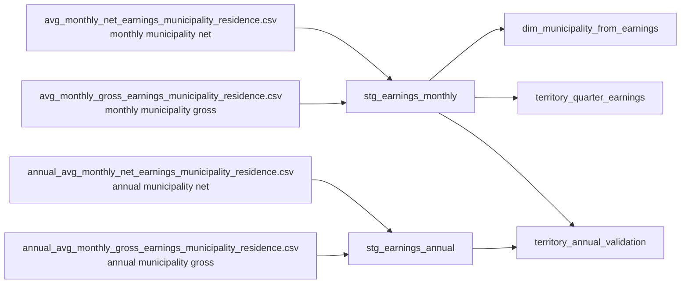

# Current Schema Design

Inspection date: 2026-04-28

## Purpose
This document describes how the current raw wage files connect to staging and mart layers.

The design is intentionally scoped to the files already present. It does not assume missing employment or reference datasets yet.

## Current Modeling Idea
We treat the four municipality earnings files as one logical family:
- monthly municipality net earnings
- monthly municipality gross earnings
- annual municipality net earnings
- annual municipality gross earnings

Instead of creating separate fact tables for each source file, we normalize them into shared structures and distinguish net vs gross through `earnings_type`.

## Layer Flow

## Raw Files And Their Join Logic

### Monthly files
- `avg_monthly_net_earnings_municipality_residence.csv`
- `avg_monthly_gross_earnings_municipality_residence.csv`

Shared natural key:
- `IDTer`
- `god`
- `mes`

Added modeling field:
- `earnings_type` from file identity

Meaning:
- one row per municipality per month per earnings type

### Annual files
- `annual_avg_monthly_net_earnings_municipality_residence.csv`
- `annual_avg_monthly_gross_earnings_municipality_residence.csv`

Shared natural key:
- `IDTer`
- `god`

Added modeling field:
- `earnings_type` from file identity

Meaning:
- one row per municipality per year per earnings type

## Staging Tables

### `stg_earnings_monthly`
Purpose:
- standardized monthly fact-like staging table

Columns:
- `source_file`
- `indicator_code`
- `indicator_name`
- `earnings_type`
- `municipality_code`
- `municipality_name`
- `year`
- `month`
- `quarter`
- `year_month`
- `value_rsd`
- `unit_code`
- `unit_name`
- `status_code`
- `status_name`
- `source_org`

Business key:
- `municipality_code + year + month + earnings_type`

### `stg_earnings_annual`
Purpose:
- standardized annual municipality validation layer

Columns:
- `source_file`
- `indicator_code`
- `indicator_name`
- `earnings_type`
- `municipality_code`
- `municipality_name`
- `year`
- `value_rsd`
- `unit_code`
- `unit_name`
- `status_code`
- `status_name`
- `source_org`

Business key:
- `municipality_code + year + earnings_type`

### `dim_municipality_from_earnings`
Purpose:
- temporary municipality dimension derived from the earnings files

Columns:
- `municipality_code`
- `municipality_name`

Note:
- this is a practical local dimension for the current phase
- later it should be replaced or validated against an official municipalities reference dataset

## Mart Tables

### `territory_quarter_earnings`
Purpose:
- main analytical table for the current portfolio phase

Grain:
- one row per `municipality + year + quarter + earnings_type`

Measures:
- `quarterly_avg_value_rsd`
- `months_in_quarter`
- `min_month_value_rsd`
- `max_month_value_rsd`

Quality flags:
- `is_complete_quarter`
- `month_list`

Build logic:
- group monthly staging rows by municipality, year, quarter, and earnings type
- average the monthly values inside the quarter

### `territory_annual_validation`
Purpose:
- compare monthly-derived annual averages with the separate annual municipality files

Grain:
- one row per `municipality + year + earnings_type`

Measures:
- `monthly_observation_count`
- `monthly_avg_value_rsd`
- `annual_file_value_rsd`
- `difference_rsd`

Quality flag:
- `is_complete_year`

Build logic:
- average the 12 monthly rows for a municipality-year-type
- compare against the annual municipality dataset for the same key

## How The Data Connects

### Safe connections already available
- monthly net to monthly gross:
  join on `municipality_code + year + month`
- annual net to annual gross:
  join on `municipality_code + year`
- monthly staging to municipality dimension:
  join on `municipality_code`
- quarterly mart to annual validation:
  connect through `municipality_code + year + earnings_type`

### Connections intentionally deferred
- territory rollups
- municipality hierarchy joins
- employment joins
- gender joins

These should wait until their official source files are added to `data/raw`.

## Recommended Next Modeling Move
The next model step should stay within the current trustworthy scope:
- build analysis-ready views from `territory_quarter_earnings`
- identify municipality trends and outliers
- create portfolio visuals from the quarterly mart

Only after that should we widen the model with employment and reference dimensions.
